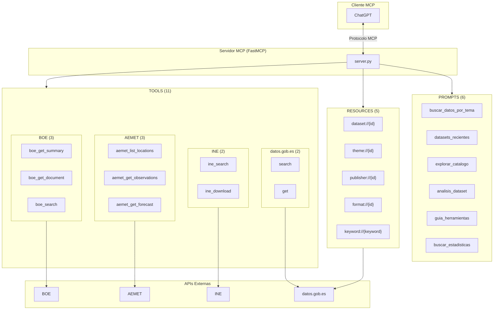

# datos-gob-es-mcp

[](https://github.com/AlbertoUAH/datos-gob-es-mcp/releases)
[](https://www.python.org/downloads/)
[](https://opensource.org/licenses/MIT)
[](https://modelcontextprotocol.io/)
[](docs/test_report.md)

**Hub de OpenData Espanol** - Servidor MCP (Model Context Protocol) que unifica el acceso a las principales fuentes de datos abiertos de Espana en una sola interfaz.

## Descripcion

Este servidor MCP actua como un **hub centralizado** que conecta multiples APIs de datos publicos espanoles, permitiendo a asistentes de IA como Claude, ChatGPT y otros clientes MCP acceder a toda la informacion desde un unico punto.

### Fuentes de datos integradas

| Fuente | Descripcion | Auth | Documentacion |
|--------|-------------|------|---------------|
| **[datos.gob.es](https://datos.gob.es/)** | Catalogo nacional de datos abiertos (+40.000 datasets) | No | [API](https://datos.gob.es/es/accessible-apidata) |
| **[INE](https://www.ine.es/)** | Instituto Nacional de Estadistica | No | [API](https://www.ine.es/dyngs/DataLab/es/manual.html) |
| **[AEMET](https://opendata.aemet.es/)** | Agencia Estatal de Meteorologia | API key | [API](https://opendata.aemet.es/dist/index.html) |
| **[BOE](https://www.boe.es/)** | Boletin Oficial del Estado | No | [API](https://www.boe.es/datosabiertos/) |

### Caracteristicas

- **11 herramientas MCP** simplificadas para consultar multiples APIs de datos publicos
- **5 recursos MCP** (templates dinamicos) para acceso directo a datos
- **6 prompts MCP** para guias de busqueda detalladas
- **Busqueda semantica**: Busqueda por significado usando embeddings (IA)
- **Cache de metadatos**: Cache local de 24h para respuestas instantaneas
- **Paginacion paralela**: Descarga 5x mas rapida con `fetch_all=True`
- **Descarga integrada**: `get(id, include_data=true)` en una sola llamada
- **Busqueda AEMET por nombre**: Usa nombres de municipio directamente (ej: "Madrid")
- **Retry automatico**: Reintentos con backoff exponencial para mayor resiliencia
- **Sinonimos INE**: Expansion de consultas para mejores resultados
- Cliente HTTP asincrono con rate limiting por API
- Modelos Pydantic para tipado seguro
- Listo para desplegar en FastMCP Cloud

## Instalacion

### Requisitos

- Python 3.10 o superior
- pip

### Instalacion rapida

```bash
# Clonar el repositorio
git clone https://github.com/AlbertoUAH/datos-gob-es-mcp.git
cd datos-gob-es-mcp

# Crear entorno virtual e instalar
make dev
```

### Instalacion manual

```bash
# Crear entorno virtual
python3 -m venv .venv
source .venv/bin/activate

# Instalar dependencias
pip install -r requirements.txt
```

## Configuracion

### Variables de entorno

Crea un archivo `.env` basandote en `.env.example`:

```bash
cp .env.example .env
```

| Variable | Requerida | Descripcion |
|----------|-----------|-------------|
| `AEMET_API_KEY` | Para meteorologia | API key de AEMET OpenData ([obtener gratis](https://opendata.aemet.es/centrodedescargas/altaUsuario)) |
| `PRELOAD_EMBEDDINGS_MODEL` | No | Pre-cargar modelo de embeddings en startup (default: true) |
| `LOG_LEVEL` | No | Nivel de logging: DEBUG, INFO, WARNING, ERROR (default: INFO) |
| `LOG_FORMAT` | No | Formato de logs: console o json (default: console) |
| `RATE_LIMIT_DATOS_GOB_ES` | No | Peticiones/segundo a datos.gob.es (default: 10) |
| `RATE_LIMIT_INE` | No | Peticiones/segundo a INE (default: 5) |
| `RATE_LIMIT_AEMET` | No | Peticiones/segundo a AEMET (default: 10) |
| `RATE_LIMIT_BOE` | No | Peticiones/segundo a BOE (default: 10) |

## Uso

### Ejecutar el servidor MCP

```bash
# Modo stdio (para clientes MCP)
make run-stdio

# O directamente
mcp run server.py
```

### Inspeccionar herramientas disponibles

```bash
make inspect
```

## Arquitectura



## Capacidades MCP

| Capacidad | Cantidad | Descripcion |
|-----------|----------|-------------|
| **Tools** | 11 | Funciones que el LLM puede invocar |
| **Resources** | 5 | Templates dinamicos para acceso directo |
| **Prompts** | 6 | Guias de busqueda predefinidas |

---

## Tools (Herramientas)

### datos.gob.es (2 herramientas)

| Herramienta | Descripcion |
|-------------|-------------|
| `search` | Busqueda unificada de datasets: por filtros (titulo, tema, publicador, formato, fecha), semantica (IA con embeddings) o hibrida. Soporta multi-tema con logica OR y paginacion paralela |
| `get` | Obtiene metadatos de un dataset y opcionalmente descarga sus datos. Con `include_data=true` descarga y parsea CSV/JSON (hasta 50MB) |

### INE - Instituto Nacional de Estadistica (2 herramientas) - FUENTE PRINCIPAL DE ESTADISTICAS

El INE es la **fuente oficial principal** de estadisticas en Espana. Contiene datos de empleo (EPA), poblacion, precios (IPC), PIB, turismo, censos, y mas.

| Herramienta | Descripcion |
|-------------|-------------|
| `ine_search` | Busca operaciones estadisticas o lista tablas. Usa `query` para buscar operaciones, `operation_id` para listar tablas |
| `ine_download` | Obtiene datos estadisticos reales de una tabla del INE |

### AEMET - Meteorologia (3 herramientas)

| Herramienta | Descripcion |
|-------------|-------------|
| `aemet_list_locations` | Lista municipios y/o estaciones meteorologicas. Usa `location_type` para filtrar |
| `aemet_get_observations` | Obtiene observaciones meteorologicas actuales de una estacion |
| `aemet_get_forecast` | Obtiene la prediccion meteorologica para un municipio (acepta nombre o codigo) |

### BOE - Boletin Oficial del Estado (3 herramientas)

| Herramienta | Descripcion |
|-------------|-------------|
| `boe_get_summary` | Obtiene el sumario del BOE. Si no se especifica fecha, devuelve el BOE mas reciente |
| `boe_get_document` | Obtiene metadatos completos de un documento del BOE por su ID |
| `boe_search` | Busca documentos en el BOE por texto en un rango de fechas |

---

## Referencia de IDs

Los IDs de temas, publicadores y provincias estan incluidos en las instrucciones del servidor MCP.

### Temas (usar con `theme=`)

economia, hacienda, educacion, salud, medio-ambiente, transporte, turismo,
empleo, sector-publico, ciencia-tecnologia, cultura-ocio, urbanismo-infraestructuras, energia

### Publicadores principales (usar con `publisher=`)

| ID | Organizacion |
|----|--------------|
| EA0010587 | INE (Instituto Nacional de Estadistica) |
| E05024401 | Ministerio de Hacienda |
| E05024301 | Ministerio de Economia |
| E00003901 | AEMET |
| L01280796 | Ayuntamiento de Madrid |
| L01080193 | Ajuntament de Barcelona |

---

## Resources (Recursos)

Templates dinamicos para acceso directo a datos de datos.gob.es:

| URI Template | Descripcion | Ejemplo |
|--------------|-------------|---------|
| `dataset://{dataset_id}` | Informacion de un dataset | `dataset://l01280066-presupuestos` |
| `theme://{theme_id}` | Datasets de una tematica | `theme://economia` |
| `publisher://{publisher_id}` | Datasets de un publicador | `publisher://E00003901` |
| `format://{format_id}` | Datasets en un formato | `format://csv` |
| `keyword://{keyword}` | Datasets con una palabra clave | `keyword://presupuestos` |

---

## Prompts (Guias de Busqueda)

Los prompts proporcionan guias estructuradas para tareas comunes de busqueda:

| Prompt | Descripcion |
|--------|-------------|
| `buscar_datos_por_tema` | Busqueda guiada de datasets por tematica y formato |
| `datasets_recientes` | Encontrar datasets actualizados en los ultimos dias |
| `explorar_catalogo` | Exploracion guiada del catalogo de datos abiertos |
| `analisis_dataset` | Analisis detallado de un dataset especifico |
| `guia_herramientas` | Documentacion de todas las herramientas MCP |
| `buscar_estadisticas` | Busqueda de estadisticas oficiales consultando INE y datos.gob.es |

---

## Ejemplos de Uso

### Buscar datasets por texto

```
Usuario: Busca datasets sobre empleo en Andalucia
Asistente: [Usa search(title="empleo Andalucia")]
```

### Buscar por significado (semantica)

```
Usuario: Encuentra datos sobre desempleo juvenil
Asistente: [Usa search(query="desempleo juvenil")]
```

### Buscar por multiples temas

```
Usuario: Busca datasets de economia o hacienda
Asistente: [Usa search(themes=["economia", "hacienda"])]
```

### Obtener y descargar datos en una sola llamada

```
Usuario: Descarga los datos del dataset de presupuestos
Asistente: [Usa get(dataset_id="l01280066-presupuestos", include_data=true)]
```

### Buscar estadisticas del INE

```
Usuario: Busca estadisticas sobre empleo
Asistente: [Usa ine_search(query="empleo")]
           -> Obtiene operacion EPA (id: 30308)
           [Usa ine_search(operation_id="30308")]
           -> Lista tablas disponibles
           [Usa ine_download(table_id="4247", n_last=12)]
           -> Obtiene datos reales
```

### Obtener el BOE mas reciente

```
Usuario: Dame el BOE de hoy
Asistente: [Usa boe_get_summary()]

Usuario: Dame el BOE del 2 de enero de 2025
Asistente: [Usa boe_get_summary(date="20250102")]
```

### Obtener prediccion meteorologica

```
Usuario: Que tiempo hara manana en Madrid?
Asistente: [Usa aemet_get_forecast(location="Madrid")]

Usuario: Que tiempo hara en Sevilla?
Asistente: [Usa aemet_get_forecast(location="Sevilla")]
```

Nota: `aemet_get_forecast` acepta tanto nombres de municipio como codigos (ej: "28079" para Madrid).

## Configuracion en Clientes MCP

### Claude Desktop

Anade a tu archivo de configuracion `claude_desktop_config.json`:

```json
{
  "mcpServers": {
    "datos-gob-es": {
      "command": "mcp",
      "args": ["run", "/ruta/a/datos-gob-es-mcp/server.py"]
    }
  }
}
```

## Desarrollo

### Comandos disponibles

```bash
make help          # Mostrar ayuda
make dev           # Instalar en modo desarrollo
make run           # Ejecutar servidor
make run-stdio     # Ejecutar en modo stdio
make inspect       # Inspeccionar herramientas MCP
make test          # Ejecutar tests
make lint          # Verificar codigo con ruff
make format        # Formatear codigo con ruff
make clean         # Limpiar archivos de cache
make notebooks     # Iniciar servidor Jupyter

# Benchmark de latencia
python scripts/latency_benchmark.py
```

### Estructura del proyecto

```
datos-gob-es-mcp/
├── server.py                 # Servidor MCP principal
├── core/                     # Modulo central
│   ├── logging.py           # Logging estructurado (structlog)
│   ├── ratelimit.py         # Rate limiting (aiolimiter)
│   ├── config.py            # Configuracion centralizada
│   └── http.py              # Cliente HTTP centralizado
├── integrations/             # APIs externas
│   ├── ine.py               # Instituto Nacional de Estadistica
│   ├── aemet.py             # Agencia de Meteorologia
│   └── boe.py               # Boletin Oficial del Estado
├── prompts/                  # Guias de busqueda MCP
├── scripts/                  # Scripts de utilidad
│   └── latency_benchmark.py # Benchmark de latencia
├── examples/                 # Jupyter notebooks de ejemplo
├── tests/                    # Tests automatizados
├── docs/                     # Documentacion adicional
│   └── latency_report.md    # Informe de latencia
├── requirements.txt         # Dependencias Python
├── Makefile                 # Comandos de desarrollo
└── README.md
```

## Rendimiento

### Latencia por herramienta

| Tool | Latencia Promedio | Clasificacion |
|------|-------------------|---------------|
| `boe_get_summary` | 54 ms | 🟢 Rapido |
| `get` (metadata) | 80 ms | 🟢 Rapido |
| `search` (titulo) | 127 ms | 🟢 Rapido |
| `boe_search` | 142 ms | 🟢 Rapido |
| `search` (tema) | 174 ms | 🟢 Rapido |
| `ine_download` | 197 ms | 🟢 Rapido |
| `search` (keyword) | 805 ms | 🟡 Moderado |
| `ine_search` | 1,368 ms | 🟡 Moderado |
| `search` (semantica) | 125 ms* | 🟢 Rapido |

\* Con `PRELOAD_EMBEDDINGS_MODEL=true` (habilitado por defecto). Ver [informe completo](docs/latency_report.md).

### Optimizaciones implementadas

| Mejora | Descripcion | Impacto |
|--------|-------------|---------|
| **Pre-carga de embeddings** | Modelo ML se carga en startup | Busqueda semantica: 35s → 125ms |
| **Cache de metadatos** | Publishers, themes, provincias y regiones se cachean 24h | Respuestas instantaneas en llamadas repetidas |
| **Cache de municipios AEMET** | Lista de municipios cacheada 24h | Evita rate limits en busquedas por nombre |
| **Paginacion paralela** | `fetch_all=True` descarga 5 paginas en paralelo | ~5x mas rapido |
| **Descarga integrada** | `get(id, include_data=true)` combina metadatos + datos | Una sola llamada |
| **HTTP/2** | Conexiones multiplexadas | Menor latencia en llamadas concurrentes |
| **Retry con backoff** | Reintentos automaticos (max 3) con backoff exponencial | Mayor resiliencia ante errores transitorios |
| **Sinonimos INE** | Expansion automatica de consultas con sinonimos | Mejores resultados de busqueda |

## Licencia

MIT License - ver [LICENSE](LICENSE) para mas detalles.

## Contribuciones

Las contribuciones son bienvenidas. Por favor, abre un issue o pull request en el repositorio.

## Enlaces

- [Model Context Protocol](https://modelcontextprotocol.io/) - Especificacion MCP
- [FastMCP](https://github.com/jlowin/fastmcp) - Framework para servidores MCP
