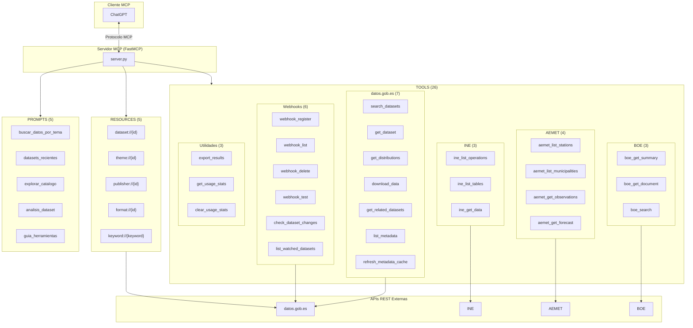

# datos-gob-es-mcp

[](https://www.python.org/downloads/)
[](https://opensource.org/licenses/MIT)
[](https://modelcontextprotocol.io/)

**Hub de OpenData Espanol** - Servidor MCP (Model Context Protocol) que unifica el acceso a las principales fuentes de datos abiertos de Espana en una sola interfaz.

## Descripcion

Este servidor MCP actua como un **hub centralizado** que conecta multiples APIs de datos publicos espanoles, permitiendo a asistentes de IA como Claude, ChatGPT y otros clientes MCP acceder a toda la informacion desde un unico punto.

### Fuentes de datos integradas

| Fuente | Descripcion | Auth | Documentacion |
|--------|-------------|------|---------------|
| **[datos.gob.es](https://datos.gob.es/)** | Catalogo nacional de datos abiertos (+40.000 datasets) | No | [API](https://datos.gob.es/es/accessible-apidata) |
| **[INE](https://www.ine.es/)** | Instituto Nacional de Estadistica | No | [API](https://www.ine.es/dyngs/DataLab/es/manual.html) |
| **[AEMET](https://opendata.aemet.es/)** | Agencia Estatal de Meteorologia | API key | [API](https://opendata.aemet.es/dist/index.html) |
| **[BOE](https://www.boe.es/)** | Boletin Oficial del Estado | No | [API](https://www.boe.es/datosabiertos/) |

### Caracteristicas

- **26 herramientas MCP** para consultar multiples APIs de datos publicos
- **5 recursos MCP** (templates dinamicos) para acceso directo a datos
- **5 prompts MCP** para guias de busqueda detalladas
- **Sistema de notificaciones**: Webhooks para detectar cambios en datasets
- **Busqueda semantica**: Busqueda por significado usando embeddings (IA)
- **Busqueda espacial inteligente**: Filtra por ubicacion usando metadatos, titulos y URIs
- **Cache de metadatos**: Cache local de 24h para respuestas instantaneas
- **Paginacion paralela**: Descarga 5x mas rapida con `fetch_all=True`
- **Descarga completa**: Obtener datasets completos (hasta 50MB)
- **Exportacion**: Exportar resultados a CSV/JSON
- Cliente HTTP asincrono con rate limiting por API
- Modelos Pydantic para tipado seguro
- Listo para desplegar en FastMCP Cloud

## Instalacion

### Requisitos

- Python 3.10 o superior
- pip

### Instalacion rapida

```bash
# Clonar el repositorio
git clone https://github.com/AlbertoUAH/datos-gob-es-mcp.git
cd datos-gob-es-mcp

# Crear entorno virtual e instalar
make dev
```

### Instalacion manual

```bash
# Crear entorno virtual
python3 -m venv .venv
source .venv/bin/activate

# Instalar dependencias
pip install -r requirements.txt
```

## Configuracion

### Variables de entorno

Crea un archivo `.env` basandote en `.env.example`:

```bash
cp .env.example .env
```

| Variable | Requerida | Descripcion |
|----------|-----------|-------------|
| `AEMET_API_KEY` | Para meteorologia | API key de AEMET OpenData ([obtener gratis](https://opendata.aemet.es/centrodedescargas/altaUsuario)) |
| `WEBHOOK_SECRET` | No | Secreto para validar firmas de webhooks |
| `LOG_LEVEL` | No | Nivel de logging: DEBUG, INFO, WARNING, ERROR (default: INFO) |
| `LOG_FORMAT` | No | Formato de logs: console o json (default: console) |
| `RATE_LIMIT_DATOS_GOB_ES` | No | Peticiones/segundo a datos.gob.es (default: 10) |
| `RATE_LIMIT_INE` | No | Peticiones/segundo a INE (default: 5) |
| `RATE_LIMIT_AEMET` | No | Peticiones/segundo a AEMET (default: 10) |
| `RATE_LIMIT_BOE` | No | Peticiones/segundo a BOE (default: 10) |

## Uso

### Ejecutar el servidor MCP

```bash
# Modo stdio (para clientes MCP)
make run-stdio

# O directamente
mcp run server.py
```

### Inspeccionar herramientas disponibles

```bash
make inspect
```

## Arquitectura



## Capacidades MCP

| Capacidad | Cantidad | Descripcion |
|-----------|----------|-------------|
| **Tools** | 26 | Funciones que el LLM puede invocar |
| **Resources** | 5 | Templates dinamicos para acceso directo |
| **Prompts** | 5 | Guias de busqueda predefinidas |

---

## Tools (Herramientas)

### datos.gob.es (7 herramientas)

| Herramienta | Descripcion |
|-------------|-------------|
| `search_datasets` | Busqueda unificada de datasets: por filtros (titulo, tema, publicador, formato, fecha), semantica (IA con embeddings) o hibrida. Soporta multi-tema con logica OR y paginacion paralela |
| `get_dataset` | Obtiene metadatos completos de un dataset por su ID: titulo, descripcion, publicador, frecuencia de actualizacion, formatos disponibles y distribuciones |
| `get_distributions` | Lista los archivos descargables de un dataset con sus formatos (CSV, JSON, XML, etc.) y URLs de acceso |
| `download_data` | Descarga y parsea datos de un dataset (hasta 50MB). Soporta CSV y JSON, devuelve preview de filas |
| `get_related_datasets` | Encuentra datasets similares usando busqueda semantica con embeddings de IA |
| `list_metadata` | Lista metadatos del catalogo: publicadores (`publishers`), tematicas (`themes`), sectores publicos (`public_sectors`), provincias (`provinces`) o comunidades autonomas (`autonomous_regions`). Cache de 24h |
| `refresh_metadata_cache` | Fuerza la actualizacion del cache de metadatos (publishers, themes, provincias, etc.) |

### INE - Instituto Nacional de Estadistica (3 herramientas)

| Herramienta | Descripcion |
|-------------|-------------|
| `ine_list_operations` | Lista operaciones estadisticas del INE. Opcionalmente filtra por texto de busqueda con el parametro `query` |
| `ine_list_tables` | Lista las tablas disponibles para una operacion estadistica |
| `ine_get_data` | Obtiene datos de una tabla estadistica del INE con los ultimos N periodos |

### AEMET - Meteorologia (4 herramientas)

| Herramienta | Descripcion |
|-------------|-------------|
| `aemet_list_stations` | Lista todas las estaciones meteorologicas de AEMET con su ubicacion |
| `aemet_list_municipalities` | Lista los municipios espanoles con codigos para predicciones |
| `aemet_get_observations` | Obtiene observaciones meteorologicas actuales de una estacion |
| `aemet_get_forecast` | Obtiene la prediccion meteorologica para un municipio |

### BOE - Boletin Oficial del Estado (3 herramientas)

| Herramienta | Descripcion |
|-------------|-------------|
| `boe_get_summary` | Obtiene el sumario del BOE. Si no se especifica fecha, devuelve el BOE mas reciente (hoy o hasta 7 dias atras) |
| `boe_get_document` | Obtiene metadatos completos de un documento del BOE por su ID (ej: `BOE-A-2024-12345`) |
| `boe_search` | Busca documentos en el BOE por texto en un rango de fechas (hasta 90 dias) |

### Webhooks - Notificaciones (6 herramientas)

| Herramienta | Descripcion |
|-------------|-------------|
| `webhook_register` | Registra un webhook para recibir notificaciones cuando un dataset cambie |
| `webhook_list` | Lista todos los webhooks registrados |
| `webhook_delete` | Elimina un webhook por su ID |
| `webhook_test` | Envia una notificacion de prueba a un webhook |
| `check_dataset_changes` | Verifica si un dataset ha cambiado desde la ultima comprobacion |
| `list_watched_datasets` | Lista los datasets que estan siendo vigilados por cambios |

### Utilidades (3 herramientas)

| Herramienta | Descripcion |
|-------------|-------------|
| `export_results` | Exporta resultados de busqueda a formato CSV o JSON |
| `get_usage_stats` | Muestra estadisticas de uso: tools mas usadas, datasets mas accedidos |
| `clear_usage_stats` | Limpia las estadisticas de uso acumuladas |

---

## Resources (Recursos)

Templates dinamicos para acceso directo a datos de datos.gob.es:

| URI Template | Descripcion | Ejemplo |
|--------------|-------------|---------|
| `dataset://{dataset_id}` | Informacion de un dataset | `dataset://l01280066-presupuestos` |
| `theme://{theme_id}` | Datasets de una tematica | `theme://economia` |
| `publisher://{publisher_id}` | Datasets de un publicador | `publisher://E00003901` |
| `format://{format_id}` | Datasets en un formato | `format://csv` |
| `keyword://{keyword}` | Datasets con una palabra clave | `keyword://presupuestos` |

---

## Ejemplos de Uso

### Buscar datasets por texto

```
Usuario: Busca datasets sobre empleo en Andalucia
Asistente: [Usa search_datasets(title="empleo", spatial_type="Autonomia", spatial_value="Andalucia")]
```

### Buscar por significado (semantica)

```
Usuario: Encuentra datos sobre desempleo juvenil
Asistente: [Usa search_datasets(semantic_query="desempleo juvenil")]
```

### Buscar por multiples temas (nuevo)

```
Usuario: Busca datasets de economia o hacienda
Asistente: [Usa search_datasets(themes=["economia", "hacienda"])]
```

### Descargar datos completos (nuevo)

```
Usuario: Descarga los datos del dataset de presupuestos
Asistente: [Usa download_data(dataset_id="l01280066-presupuestos", max_mb=20)]
```

### Encontrar datasets relacionados (nuevo)

```
Usuario: Encuentra datasets similares a este de poblacion
Asistente: [Usa get_related_datasets(dataset_id="...", top_k=10)]
```

### Obtener distribuciones de un dataset

```
Usuario: Que formatos tiene disponible este dataset?
Asistente: [Usa get_distributions(dataset_id="l01280066-presupuestos")]
```

### Exportar resultados de busqueda (nuevo)

```
Usuario: Exporta estos resultados a CSV
Asistente: [Usa export_results(search_results="...", format="csv")]
```

### Ver estadisticas de uso

```
Usuario: Que herramientas he usado mas?
Asistente: [Usa get_usage_stats(include_searches=true)]
```

### Listar metadatos del catalogo

```
Usuario: Muestra las tematicas disponibles
Asistente: [Usa list_metadata(metadata_type="themes")]

Usuario: Lista las provincias espanolas
Asistente: [Usa list_metadata(metadata_type="provinces")]
```

### Buscar operaciones del INE

```
Usuario: Busca estadisticas sobre empleo
Asistente: [Usa ine_list_operations(query="empleo")]
```

### Obtener el BOE mas reciente

```
Usuario: Dame el BOE de hoy
Asistente: [Usa boe_get_summary()]

Usuario: Dame el BOE del 2 de enero de 2025
Asistente: [Usa boe_get_summary(date="20250102")]
```

## Configuracion en Clientes MCP

### Claude Desktop

Anade a tu archivo de configuracion `claude_desktop_config.json`:

```json
{
  "mcpServers": {
    "datos-gob-es": {
      "command": "mcp",
      "args": ["run", "/ruta/a/datos-gob-es-mcp/server.py"]
    }
  }
}
```

## Desarrollo

### Comandos disponibles

```bash
make help          # Mostrar ayuda
make dev           # Instalar en modo desarrollo
make run           # Ejecutar servidor
make run-stdio     # Ejecutar en modo stdio
make inspect       # Inspeccionar herramientas MCP
make test          # Ejecutar tests
make lint          # Verificar codigo con ruff
make format        # Formatear codigo con ruff
make clean         # Limpiar archivos de cache
make notebooks     # Iniciar servidor Jupyter
```

### Estructura del proyecto

```
datos-gob-es-mcp/
├── server.py                 # Servidor MCP principal
├── core/                     # Modulo central
│   ├── logging.py           # Logging estructurado (structlog)
│   ├── ratelimit.py         # Rate limiting (aiolimiter)
│   └── http.py              # Cliente HTTP centralizado
├── integrations/             # APIs externas
│   ├── ine.py               # Instituto Nacional de Estadistica
│   ├── aemet.py             # Agencia de Meteorologia
│   └── boe.py               # Boletin Oficial del Estado
├── notifications/            # Sistema de webhooks
│   ├── webhook.py           # Gestor de webhooks
│   └── watcher.py           # Vigilante de cambios
├── prompts/                  # Guias de busqueda MCP
├── examples/                 # Jupyter notebooks de ejemplo
│   ├── 01_introduccion.ipynb
│   ├── 02_busqueda_datasets.ipynb
│   ├── 03_analisis_datos.ipynb
│   ├── 04_integraciones.ipynb
│   └── 05_webhooks.ipynb
├── tests/                    # Tests automatizados
├── docs/                     # Documentacion adicional
│   └── DEPLOYMENT.md        # Guia de despliegue
├── requirements.txt         # Dependencias Python
├── Makefile                 # Comandos de desarrollo
└── README.md
```

## Rendimiento

### Optimizaciones implementadas

| Mejora | Descripcion | Impacto |
|--------|-------------|---------|
| **Cache de metadatos** | Publishers, themes, provincias y regiones se cachean 24h | Respuestas instantaneas en llamadas repetidas |
| **Paginacion paralela** | `fetch_all=True` descarga 5 paginas en paralelo | ~5x mas rapido |
| **Descarga streaming** | `download_data` usa streaming para archivos grandes | Soporte hasta 50MB |
| **Embeddings cacheados** | Indice semantico se guarda en disco | Primera busqueda ~30s, siguientes <1s |
| **Metricas de uso** | Registro de herramientas y datasets mas usados | Optimizacion de workflows |
| **Exportacion de resultados** | Exportar busquedas a CSV/JSON | Analisis externo de datos |
| **Filtro espacial mejorado** | Busca en campo spatial, titulo y URI | Encuentra datasets sin metadatos espaciales |

## Licencia

MIT License - ver [LICENSE](LICENSE) para mas detalles.

## Contribuciones

Las contribuciones son bienvenidas. Por favor, abre un issue o pull request en el repositorio.

## Enlaces

- [Model Context Protocol](https://modelcontextprotocol.io/) - Especificacion MCP
- [FastMCP](https://github.com/jlowin/fastmcp) - Framework para servidores MCP
